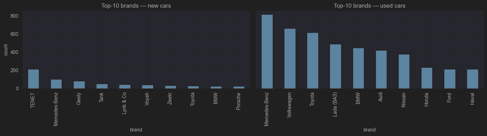
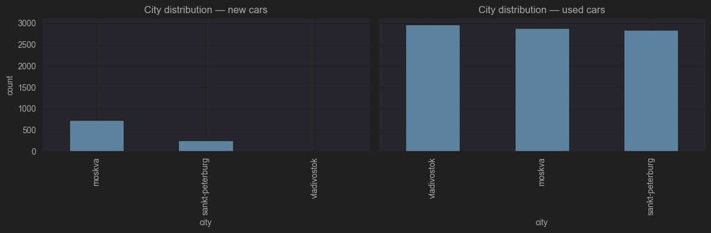
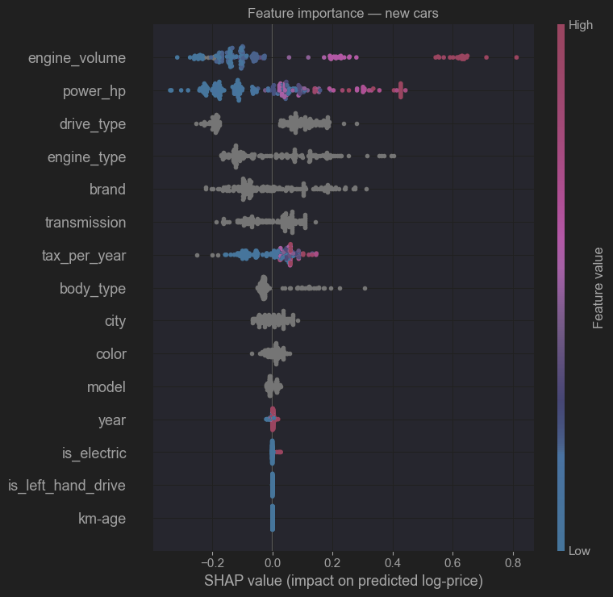
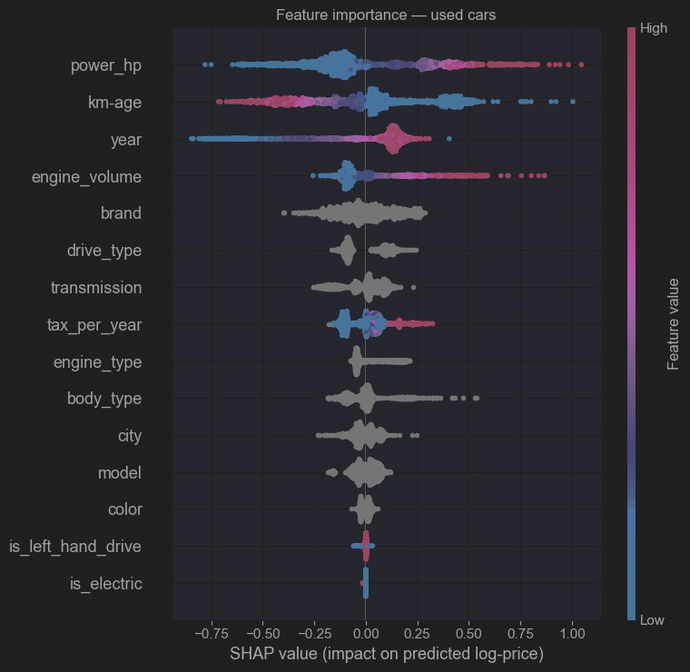
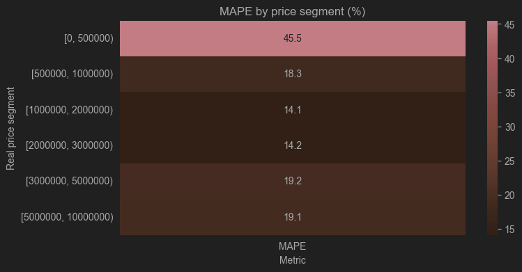
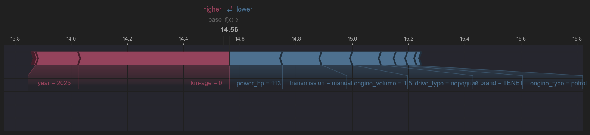
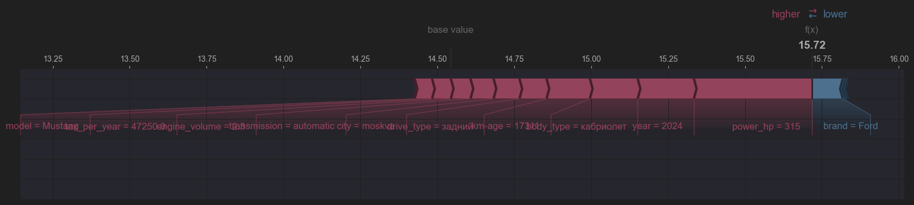

## Анализ и предсказание цен на автомобили на основе данных с [Auto.ru](https://auto.ru/cars)

Был произведен парсинг сайта [Auto.ru](https://auto.ru/cars). Собиралась информация по 99 страницам объявлений для новых
и старых авто в Санкт-Петербурге, Москве и Владивостоке.

Санкт-Петербург и Москва были выбраны как наиболее широкие рынки в РФ. Владивосток был добавлен для того, чтобы
сбалансировать распределение автомобилей с левым и правым рулем.

Сбор данных производился в январе 2026 года. Размер полученного датасета 10 тыс. строк.

***Датасет был разделен на 2 части***: новые и подержанные автомобили. Такой подход обусловлен тем, что важные при
ценообразовании признаки для новых и подержанных авто различны.

Анализ данных и построение ML модели с помощью CatBoost выполнялось
в [Jupiter notebook](./car_price_prediction_auto_ru.ipynb).

### Структура датасета

```
{
    "city",                  # регион
    "is_new",                # новый / с пробегом
    "price",                 # цена в руб., целевая переменная
    "tax_per_year",          # налог в руб. в год
    "year",                  # год выпуска
    "km-age",                # пробег в км
    "brand",                 # марка
    "model",                 # модель
    "color",                 # цвет

    "body_type",             # тип кузова
    "drive_type",            # привод
    "transmission",          # коробка
    "engine_type",           # тип двигателя
    "engine_volume",         # объем двигателя (NULL для электроавтомобилей)
    "power_hp",              # мощность двигателя
    "is_left_hand_drive",    # тип руля

    "url"                    # идентификатор
}
```

### Анализ распределения признаков




### Feature importance




### Модель для предсказания цены автомобиля





